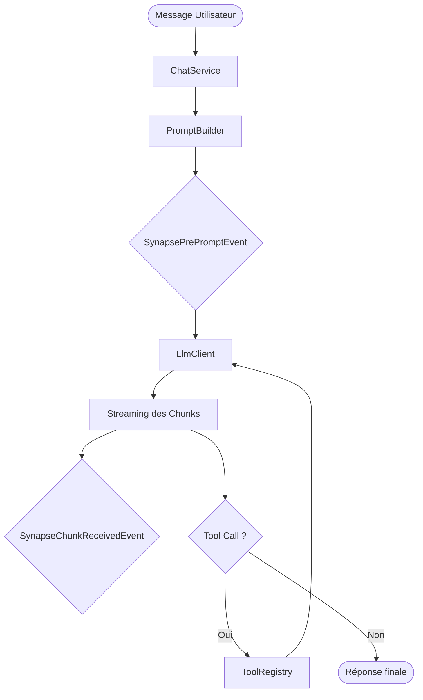

# Architecture & Flux

Synapse Core repose sur un flux d'exécution séquentiel et évènementiel.

## Flux de génération

1.  **Réception du message** via `ChatService`.
2.  **Construction du prompt** via le `PromptBuilder`.
3.  **Événement `SynapsePrePromptEvent`** : Modification possible du prompt par l'application hôte.
4.  **Appel LLM** via le client dédié (Gemini, OpenAI, etc.).
5.  **Streaming des chunks** avec dispatch de `SynapseChunkReceivedEvent`.
6.  **Détection de Tool Call** : Si le LLM demande un outil, Synapse l'exécute et relance une boucle de génération.
7.  **Finalisation** : Enregistrement en base de données et dispatch de `SynapseGenerationCompletedEvent`.

## Schéma simplifié

