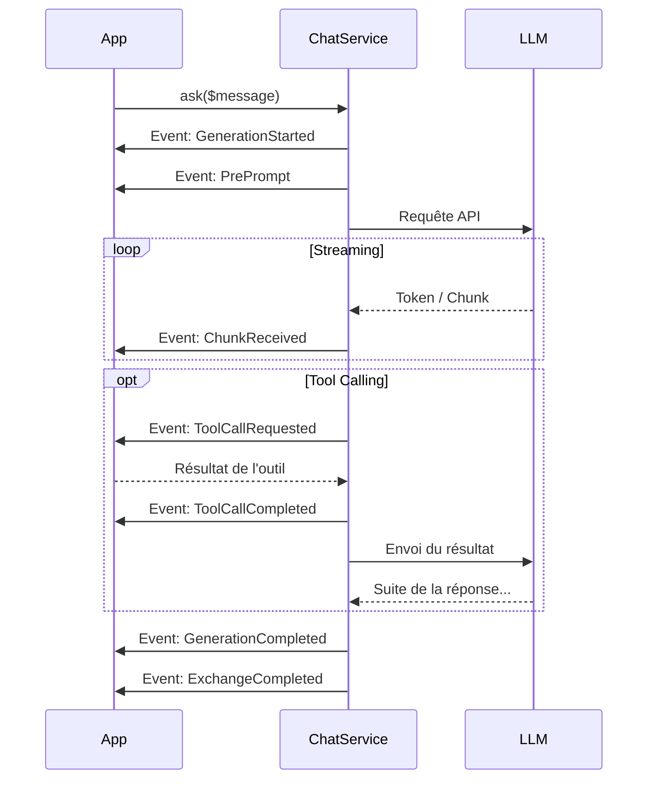

# Cycle de vie des Événements

Synapse Core est entièrement évènementiel. Cela vous permet d'intervenir à chaque étape de la génération pour modifier le comportement de l'IA.

## Séquence d'exécution

Voici l'ordre d'apparition des événements lors d'un appel à `ChatService::ask()` :

1.  **`SynapseGenerationStartedEvent`** : Début global. Initialisation.
2.  **`SynapsePrePromptEvent`** : **Crucial.** Modification du prompt système ou du contexte juste avant l'envoi.
3.  **`SynapseChunkReceivedEvent`** : Répété pour chaque token reçu (Streaming).
4.  **`SynapseToolCallRequestedEvent`** : Si le LLM demande un outil. Déclenche l'exécution.
5.  **`SynapseToolCallCompletedEvent`** : Une fois l'outil exécuté, contient le résultat.
6.  *Retour à l'étape 3 si le LLM a besoin de traiter les résultats d'outils.*
7.  **`SynapseGenerationCompletedEvent`** : Fin de la génération textuelle.
8.  **`SynapseExchangeCompletedEvent`** : Fin technique de l'échange (Debug & Logs).

## Diagramme des flux

