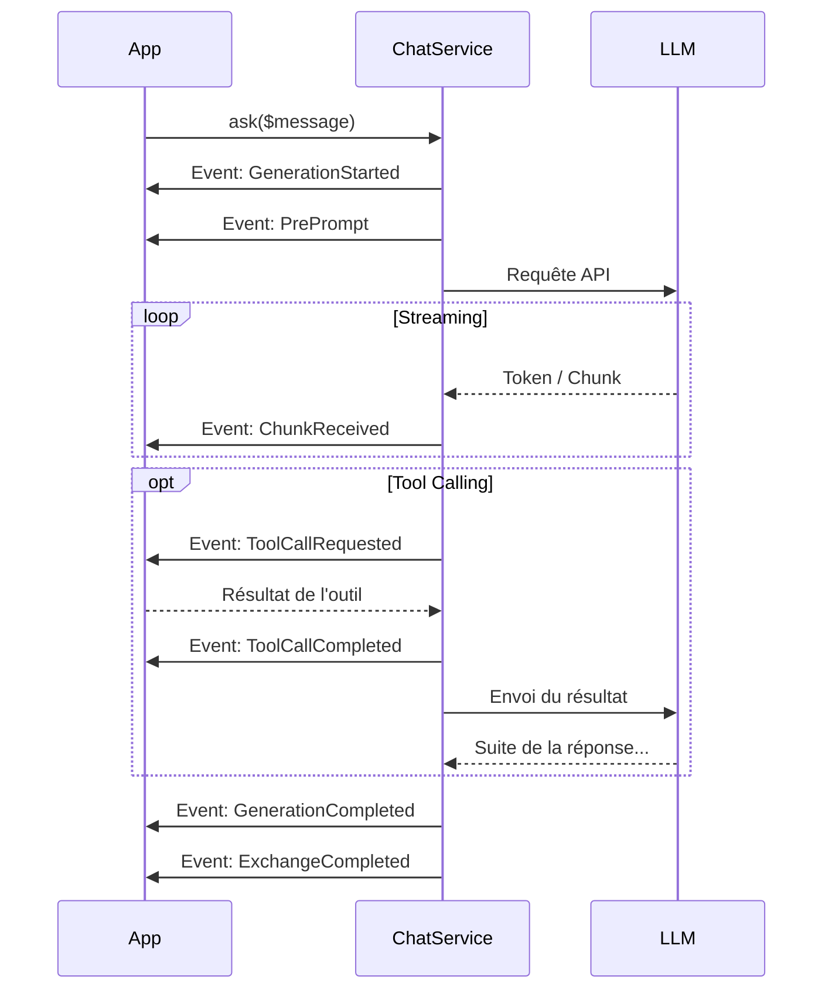

# Cycle de vie des Événements

Synapse Core est entièrement évènementiel. Cela vous permet d'intervenir à chaque étape de la génération pour modifier le comportement de l'IA.

## Séquence d'exécution

Voici l'ordre d'apparition des événements lors d'un appel à `ChatService::ask()` :

1.  **`SynapseGenerationStartedEvent`** : Début global. Initialisation.
2.  **`SynapsePrePromptEvent`** : **Crucial.** Modification du prompt système ou du contexte juste avant l'envoi.
3.  **`SynapseChunkReceivedEvent`** : Répété pour chaque token reçu (Streaming).
4.  **`SynapseToolCallRequestedEvent`** : Si le LLM demande un outil. Déclenche l'exécution.
5.  **`SynapseToolCallCompletedEvent`** : Une fois l'outil exécuté, contient le résultat.
6.  *Retour à l'étape 3 si le LLM a besoin de traiter les résultats d'outils.*
7.  **`SynapseGenerationCompletedEvent`** : Fin de la génération textuelle.
8.  **`SynapseExchangeCompletedEvent`** : Fin technique de l'échange (Debug & Logs).

## Événements hors cycle de chat

### `SynapseEmbeddingCompletedEvent`

Déclenché à chaque fois qu'un embedding est généré (via `EmbeddingService`). Utilisé notamment par `TokenAccountingService` pour enregistrer la consommation en tokens liée aux embeddings.

```php
use ArnaudMoncondhuy\SynapseCore\Shared\Event\SynapseEmbeddingCompletedEvent;

class MyEmbeddingSubscriber implements EventSubscriberInterface
{
    public function onEmbeddingCompleted(SynapseEmbeddingCompletedEvent $event): void
    {
        echo $event->getModel();        // ex: "text-embedding-004"
        echo $event->getProvider();     // ex: "gemini"
        echo $event->getPromptTokens(); // tokens consommés
        echo $event->getTotalTokens();  // total tokens
    }

    public static function getSubscribedEvents(): array
    {
        return [SynapseEmbeddingCompletedEvent::class => 'onEmbeddingCompleted'];
    }
}
```

### `SynapseSpendingLimitExceededEvent`

Déclenché par `SpendingLimitChecker::assertCanSpend()` juste **avant** de lever `LlmQuotaException`, lorsqu'une requête dépasserait un plafond de dépense configuré.

Permet à l'application hôte de réagir sans modifier le core : envoyer une notification, logger l'incident, ou déclencher un fallback.

```php
use ArnaudMoncondhuy\SynapseCore\Event\SynapseSpendingLimitExceededEvent;
use Symfony\Component\EventDispatcher\EventSubscriberInterface;

class SpendingAlertSubscriber implements EventSubscriberInterface
{
    public function onLimitExceeded(SynapseSpendingLimitExceededEvent $event): void
    {
        // Qui a déclenché le blocage ?
        $event->getUserId();         // ex: "user-42"
        $event->getScope();          // 'user' | 'preset' | 'agent'
        $event->getScopeId();        // identifiant de la ressource

        // Chiffres
        $event->getLimitAmount();    // ex: 10.0
        $event->getConsumption();    // ex: 9.5
        $event->getEstimatedCost(); // ex: 1.2
        $event->getProjectedConsumption(); // 10.7 (au-dessus du plafond)
        $event->getOverrunAmount();  // 0.7 (dépassement)
        $event->getCurrency();       // 'EUR'
        $event->getPeriod();         // SpendingLimitPeriod::SLIDING_DAY
    }

    public static function getSubscribedEvents(): array
    {
        return [SynapseSpendingLimitExceededEvent::class => 'onLimitExceeded'];
    }
}
```

> `LlmQuotaException` est toujours levée après le dispatch — cet event ne permet pas d'annuler le blocage.

## Diagramme des flux


```mermaid
sequenceDiagram
    participant App
    participant ChatService
    participant LLM
    
    App->>ChatService: ask($message)
    ChatService->>App: Event: GenerationStarted
    ChatService->>App: Event: PrePrompt
    ChatService->>LLM: Requête API
    loop Streaming
        LLM-->>ChatService: Token / Chunk
        ChatService->>App: Event: ChunkReceived
    end
    opt Tool Calling
        ChatService->>App: Event: ToolCallRequested
        App-->>ChatService: Résultat de l'outil
        ChatService->>App: Event: ToolCallCompleted
        ChatService->>LLM: Envoi du résultat
        LLM-->>ChatService: Suite de la réponse...
    end
    ChatService->>App: Event: GenerationCompleted
    ChatService->>App: Event: ExchangeCompleted
```
